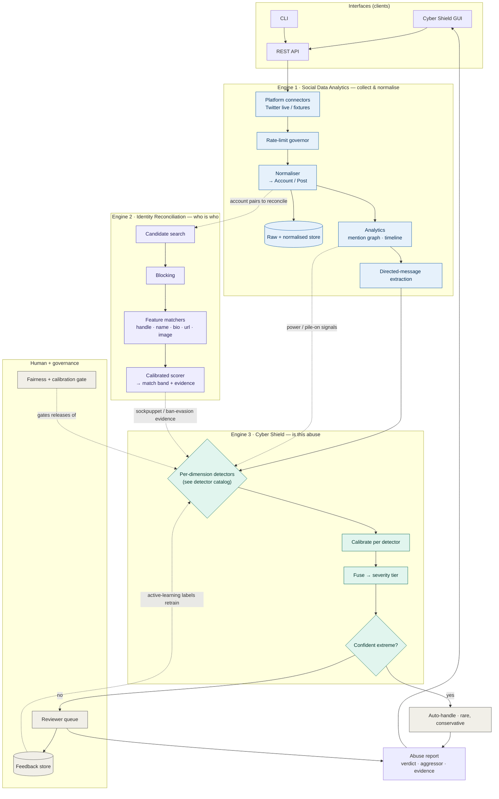

# CyberShield — System Flowchart

This is the single composed view of the whole platform: the three engines, what
each one is responsible for internally, and how data flows from raw collection
through to an explained abuse report and back into the models. It ties together
the detail spread across [ARCHITECTURE.md](ARCHITECTURE.md) (the layering), the
[decision records](decisions/README.md) (the pipeline decisions and detector
catalog), and the abuse rubric in the documentation repository.

Read it top to bottom: the interfaces feed Engine 1, which collects and
normalises data; Engine 1 feeds Engine 3 (the abuse pipeline) with directed
messages and feeds Engine 2 when an identity needs reconciling; Engine 2 feeds
evidence back into Engine 3; and the human-and-governance band closes the loop by
reviewing, retraining, and gating releases.

## The composed flowchart

## How to read it

Solid arrows are the main request path; dotted arrows are supporting signals and
feedback. The colour of a box tells you which engine owns it:

- **Blue — Engine 1, Social Data Analytics.** Owns acquisition and the structural
  context: connectors (live or fixtures), the rate governor, normalisation into
  the shared `Account` / `Post` model, the raw and normalised stores, and the
  analytics (mention graph, timeline) that feed both the abuse pipeline and the
  directed-message extraction.
- **Purple — Engine 2, Identity Reconciliation.** Owns "who is who": candidate
  search, blocking for scale, the feature matchers, and the calibrated scorer. In
  the abuse setting its job is to feed sockpuppet / ban-evasion evidence into
  Engine 3 so a single abuser can't masquerade as a crowd or evade a block.
- **Green — Engine 3, Cyber Shield.** Owns the verdict: the per-dimension
  detectors, per-detector calibration, transparent fusion into a severity tier,
  and routing. The detectors themselves are enumerated in the
  [detector catalog](decisions/README.md#detector-catalog).
- **Neutral — Human + governance.** The reviewer queue, the feedback store that
  turns reviewer decisions into training labels, and the fairness + calibration
  gate that every detector release must pass.

## Why the loops matter

Two dotted loops are the heart of the design rather than decoration. The
**feedback loop** (reviewer → feedback store → retrain the detectors) keeps the
system current against adversarial, shifting abuse and concentrates learning on
the hardest, human-judged cases. The **release gate** (fairness + calibration
audit → gates detector releases) ensures nothing ships that is accurate in
aggregate but biased against particular groups. Together they encode the principle
that the engines assemble and explain evidence while a human owns the irreducible
judgement.

## Where this fits

This flowchart is the bird's-eye composition. For depth, follow the links: the
layering and deployment profiles are in [ARCHITECTURE.md](ARCHITECTURE.md); the
reasoning behind the pipeline's shape is in the [ADRs](decisions/README.md); and
the definition of abuse the detectors are chasing is the working rubric in the
documentation repository's planning document. A colour-coded, browser-openable
version of the abuse pipeline specifically is at
[decisions/pipeline-visualization.html](decisions/pipeline-visualization.html).
