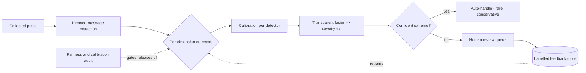

# Architecture Decision Records — Abuse Detection Pipeline

This directory captures the decisions that guide development of CyberShield's
**decomposed, calibrated, explainable** abuse-detection pipeline. Each decision
lives in its own file so it can be discussed, revised or superseded on its own.

These records are the engineering counterpart to the *What Counts as Abuse:
A Working Rubric* section of the planning document in the documentation
repository. The rubric says *what* the dimensions of abuse are and which engine
is best suited to each; these ADRs say *how* we turn that into software, and
where we deliberately stop and hand off to a human.

## Why ADRs

An Architecture Decision Record states a single decision, the context that forced
it, and the consequences we accept by making it. The value is not the prose — it
is that six months later a contributor can see *why* the pipeline is shaped this
way and whether the reasons still hold. A decision is never deleted; if we change
our minds we add a new ADR that supersedes the old one and mark the old one
accordingly.

Status values: `Proposed`, `Accepted`, `Superseded by ADR-XXXX`, `Deprecated`.

## The decisions

| ADR | Decision | Status |
| --- | --- | --- |
| [0001](ADR-0001-decompose-into-per-dimension-detectors.md) | Decompose detection into per-dimension detectors, not one model | Accepted |
| [0002](ADR-0002-calibrated-probabilities.md) | Every detector emits a calibrated probability | Accepted |
| [0003](ADR-0003-evidence-first-explainability.md) | Every score carries its evidence (explainable by construction) | Accepted |
| [0004](ADR-0004-transparent-fusion-to-severity-tiers.md) | Fuse detector outputs into severity tiers transparently | Accepted |
| [0005](ADR-0005-human-in-the-loop-routing.md) | Route by confidence; humans own the ambiguous middle | Accepted |
| [0006](ADR-0006-feedback-loop-active-learning.md) | Reviewer decisions feed a labelled training loop | Accepted |
| [0007](ADR-0007-fairness-and-calibration-gate.md) | Fairness + calibration auditing is a release gate | Accepted |
| [0008](ADR-0008-llm-as-judge-guarded-signal.md) | LLM-as-judge is one guarded signal, never the verdict | Accepted |

## The pipeline at a glance

A richer, colour-coded view — detectors grouped by how tractable they are and by
which engine owns them — lives in
[pipeline-visualization.html](pipeline-visualization.html); open it in a browser.

## Detector catalog

Each dimension of the rubric becomes one or more **detectors**. A detector is a
small component that looks at one facet, emits a calibrated score plus evidence,
and declares which engine owns it. The catalog below is the backlog: tractability
is an honest estimate of how well software can do the job today, which is also a
signal for how much the output should be trusted versus routed to a human.

| Dimension (rubric) | Detector | Approach | Owning engine | Tractability |
| --- | --- | --- | --- | --- |
| Directionality / target | `DirectedMessageExtractor` | Thread + mention/reply graph parsing | Social Data Analytics → Cyber Shield | High |
| Content category / severity | `ContentClassifier` | Multi-label toxicity / hate / threat models; NER for doxxing (posted PII) | Cyber Shield | High → Medium |
| Intent vs criticism | `TargetStanceDetector` | Target-dependent (aspect-based) sentiment; LLM stance | Cyber Shield | Medium |
| Persistence / escalation | `TemporalPatternDetector` | Frequency, recurrence-after-block, burst & trend detection | Social Data Analytics | High |
| Power / pile-on | `AsymmetryDetector` | Follower/engagement ratios; many-to-one fan-in; coordination clustering | Social Data Analytics | Medium → High |
| Sockpuppet / ban-evasion | `IdentityLinker` | Stylometry + behavioural fingerprint + graph clustering | Identity Reconciliation | Medium |
| Counterspeech | `CounterspeechDetector` | Stance detection ("is this defending the target?") | Cyber Shield | Medium |
| Sarcasm / reclaimed language | `ContextAmbiguityFlag` | LLM + group-membership / relationship features; flags for routing | Cyber Shield + human | Low |
| Unwantedness / consent | `RelationshipModel` | Interaction-history features; contact after a stop/block as a proxy | Social Data Analytics + human | Low |

The two `Low` rows are deliberate: they are not failures to be engineered away but
the points where the system's job is to *flag ambiguity and route to a person*,
per ADR-0005.
